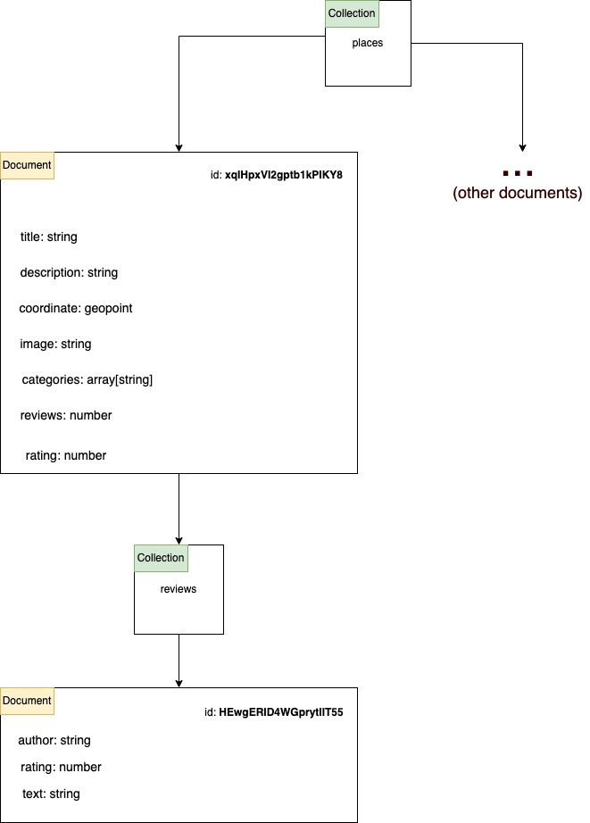

# Monhapp

Monhapp is a [React Native](https://reactnative.dev/) + [Expo](https://expo.dev/) mobile app for geofinding locations of stores owned by immigrants from central Asia (e.g.: Indians, Pakistanis, Bangladeshis), commonly known as Monhés in Portuguese. The number of this type of stores has increased over the last years in Portugal and most of Western Europe, and can sell all sort of things ranging from tech gadgets to alchoolic drinks.

This app was not developed from scratch, having used [this](https://github.com/itzpradip/Food-Finder-React-Native-App) Github repo as a starting point.

This app uses a [Firebase Firestore](https://firebase.google.com/docs/firestore) to store the data, and [Firebase Storage](https://firebase.google.com/docs/storage) to store images.

The app assumes the Firestore backend has the following schema:

